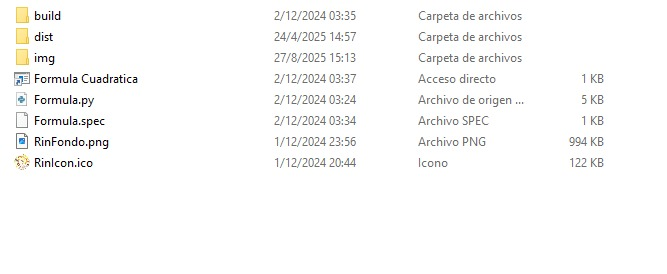
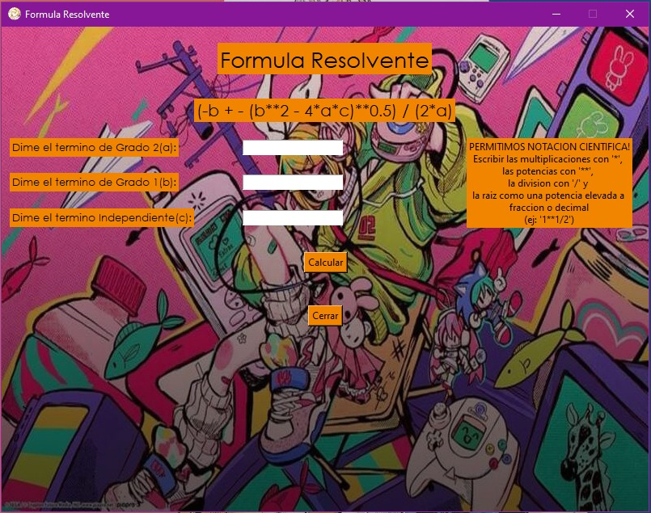
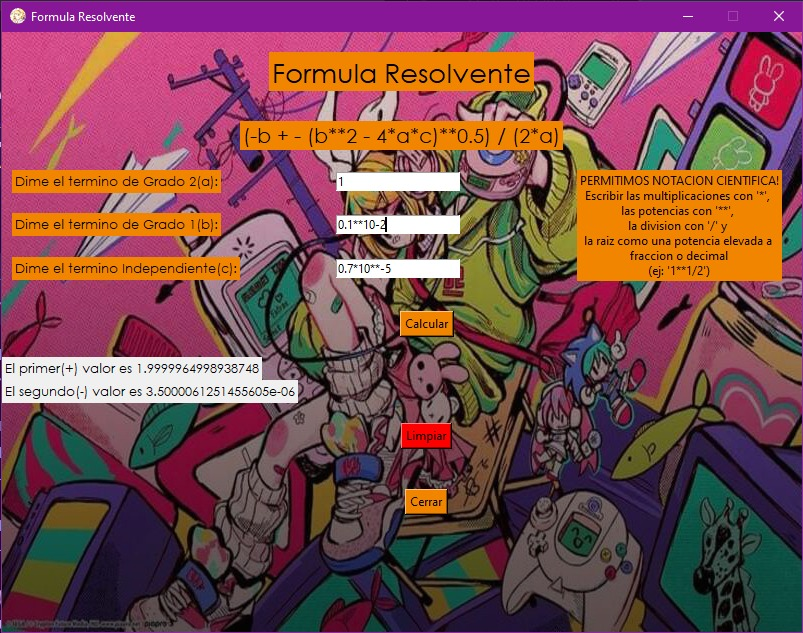

# 🧮 Fórmula Resolvente - Python Tkinter

Una pequeña calculadora de la **fórmula cuadrática (fórmula resolvente)** desarrollada completamente en **Python** utilizando la biblioteca gráfica **Tkinter**.

Este fue uno de mis primeros proyectos aprendiendo Python, por lo que se trata de una aplicación simple enfocada en el uso personal y la práctica de conceptos básicos de programación e interfaces gráficas.

---

## 📦 Ejecutable

El archivo ejecutable del programa se encuentra en la siguiente ubicación:

```
Resolvente/dist/Formula Cuadratica.exe
```



---

## 🖥️ Interfaz del programa

La aplicación permite ingresar los valores de los coeficientes de una ecuación cuadrática y calcular sus soluciones mediante la fórmula resolvente.



---

## ⚠️ Consideraciones

Al ser un proyecto realizado durante mis primeras etapas de aprendizaje en Python:

- No cuenta con validaciones avanzadas de entrada de datos.
- Puede generar errores si se ingresan valores no válidos o inesperados.
- Su objetivo principal fue aprender sobre el uso de Tkinter, la manipulación de eventos y la creación de interfaces gráficas.

Como detalle humorístico, la interfaz incluye una imagen de fondo de la Vocaloid **Kagamine Rin**.



---

## 🛠️ Tecnologías utilizadas

- Python
- Tkinter

---

## 📚 Propósito del proyecto

Este proyecto representa uno de mis primeros pasos en el aprendizaje de Python y el desarrollo de aplicaciones de escritorio. Se mantiene como una muestra de mi progreso y de mis primeros experimentos con interfaces gráficas.
